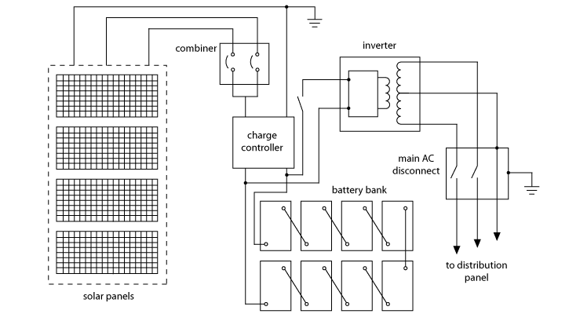

# The Provider side

To become an electricity provider, an individual or business must invest in solar energy infrastructure, including solar panels, batteries, and inverters. The solar panels are typically installed on rooftops, as it provides an ideal location for maximum exposure to capture sunlight and convert it into electricity, which is then stored in batteries for use during periods of low sunlight. The inverters convert the direct current (DC) electricity from the panels and batteries into alternating current (AC) electricity that can be used to power electrical devices.&#x20;

<figure><figcaption>
Solar installation Diagram
</figcaption></figure>


**Compliance and Safety:** Providers may need to evaluate the suitability of the roof, ensuring it can support the weight of the solar panels and must adhere to relevant regulations and safety standards in their region when installing solar equipment. This may involve obtaining permits and ensuring compliance with local building codes and electrical regulations to ensure the safety and reliability of the system.


Alongside the solar equipment, providers need to install M3ter device. These specialized devices measure the electricity generated by the solar panels and the electricity consumed by the consumers and was designed specifically to bridge the gap between distributed energy resources (such as rooftop solar assets) and the web3.0 economy. its data is crucial for accurate tracking, verification, and billing of the energy transactions on the protocol. Learn more about current M3ters: [Maxwell](https://raw.githubusercontent.com/WhyNotSwitch/Maxwell-Docs/master/SPBrochure\_06-05-2023.pdf).&#x20;

<figure><figcaption></figcaption></figure>

Once the solar infrastructure and M3tering meters are installed, providers need to ensure regular maintenance and monitoring of the system's performance. This includes periodic checks to  ensure that there are no obstructions blocking sunlight, identify and resolve any technical issues, and ensuring optimal energy production and delivery.

With the solar infrastructure set up and operational, the provider can then participate in the M3tering Protocol by connecting to the decentralized network. The protocol facilitates the interaction between providers and consumers, enabling the secure exchange of clean energy for pre-paid stablecoins, and rewarding providers.
