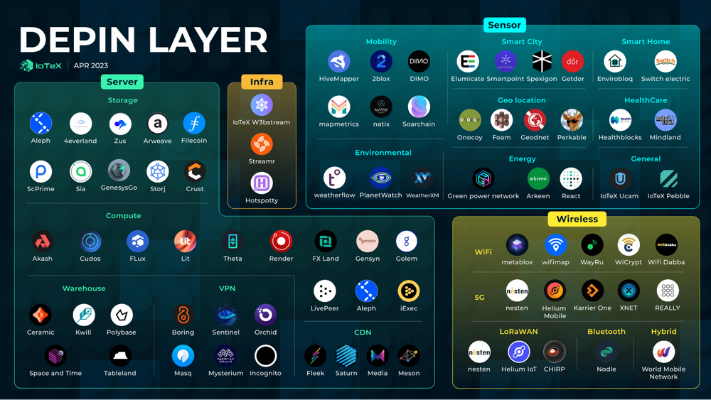

# Token Rewards & Network Effects

When providers claim their token rewards, the protocol operates in the background to convert the stablecoins that consumers paid for electricity into an equal value of the protocol's native tokens. This conversion happens on a decentralized exchange liquidity pool. This conversion enables the token to capture some of the value inherent in the protocols network effects. In the context of the M3tering Protocol, network effects play a crucial role in driving the expansion of the protocol by attracting both electricity providers and offtakers.


**Network effects** occur when the value and usefulness of a system or platform increase as more participants join and use it. Learn more [here](https://en.wikipedia.org/wiki/Network\_effect)


Providers are enticed to join the protocol due to the lucrative opportunity to earn token rewards for participating in decentralized electrification. As more providers come on board or increase their installed capacity, they sign up more offtakers, driven by a preference for reliable, affordable and clean supply of electricity. Consequently, more payments from offtakers leads to an augmented demand for the protocol's token on the decentralized exchange, thereby influencing its price. This, in turn, acts as an incentive for more providers to join the network, creating a cyclical pattern of growth, often referred to as the flywheel effect.&#x20;

<figure><figcaption></figcaption></figure>

This effect is in no way unique to the M3tering protocol, in fact, it is very popular with a niche of decentralized application know as Decentralized Physical Infrastructure Networks (_DePIN_). Popular examples include the Helium Network, Filecoin & the Render Network.&#x20;


While the concept may sound promising, its success is not guaranteed. The most common setback occurs when the expected demand fails to materialize. Checkout this article by CoinMarketCap to catchup on [DePIN](https://coinmarketcap.com/alexandria/article/a-deep-dive-into-depin-decentralized-physical-infrastructure)


<figure><figcaption>
DePIN Sector Map (April 2023)
</figcaption></figure>

In summary, the DePIN Flywheel Effect is a dynamic process that leverages token incentives, network expansion, and increasing token value to drive self-sustaining growth and adoption of decentralized physical infrastructure networks. The continuous cycle of growth leads to greater value and benefits for the participants and the broader community.
